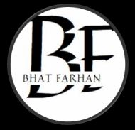

<!DOCTYPE html>
<html lang="en">
<head>
    <meta charset="UTF-8">
    <meta name="viewport" content="width=device-width, initial-scale=1.0">
    <title>Portfolio</title>
    <link rel="stylesheet" href="STYLE.CSS">
    <link rel="stylesheet" href="https://cdnjs.cloudflare.com/ajax/libs/font-awesome/6.6.0/css/all.min.css">
    
</head>
<body>
    

    <nav>
        
        <ul id="sidemenu">
               <li><a href="#header">Home</a></li>
               <li><a href="#about">About</a></li>
               <li><a href="#services">Services</a></li>
               <li><a href="#portfolio">Portfolio</a></li>
               <li><a href="#contact">Contact</a></li>
               <i class="fa-solid fa-circle-xmark" onclick="closemenu()"></i>
        </ul>
        <i class="fa-solid fa-bars" onclick="openmenu()"></i>
    </nav>
    

        
UI/UX Designer

        <h1> Hi,I'm  Bhat Farhan   From Kashmir</h1>
        
    
 

<!-----------------ABOUT---------------->

    

        

            

                
            

            

                <h1 class="subtitle" >About Me </h1>
                
I am a Computer Engineering Graduate From Govt Degree Collage Anantnag... Technology excites me and I am always in awe of the change it drives in the world.  Certain skills that I have worked with include   Data Structures and Algorithms (C)   App Development(Kotlin)  Web Development (Html, Css, JavaScript)  Graphics Designing (Adobe Premium Pro )   Designing (with CorelDraw)..  And what I might lack in skills I make up for with my determination to learn...
                    Outside of tech, I am a poet, an avid actor and have spent my college days exploring theatre.

                

                    
Skills

                    
Expreience

                    
Education

                

                

                    <ul>
                    <li>UI/UX  Desiging Web/App interface</li>
                    <li>App Development  Building Android App</li>
                    <li>Video Editor Make Youtube Video</li>
                    </ul>
                

                

                    <ul>
                    <li>2022-2023 Video Editor at Encreator Company</li>
                    <li>2020-2022 Graphics Designer at Samir Sign</li>
                    </ul>
                

                

                    <ul>
                    <li>2023-present Bachleor in Computer Application At Govt Degree Collage Anantnag </li>
                    </ul>
                

            

        

    

<!-----------------services---------------->

    

        <h1 class="subtitle" >My services </h1>
        

            

                <i class="fa-brands fa-uikit"></i>
                <h2>UI/UX</h2>
                
I provide UI/UX services that prioritize intuitive design, seamless navigation, user-centric interfaces, and enhanced digital experiences for optimal engagement.

                <a href="">Learn More</a>
            

            

                <i class="fa-brands fa-app-store"></i>
                <h2>App Development</h2>
                
I offer app development services, creating responsive, feature-rich, and user-friendly applications tailored to meet client-specific needs and goals.

                <a href="">Learn More</a>
            

            

                <i class="fa-solid fa-video"></i>
                <h2>Video Editing</h2>
                
I provide video editing services, delivering polished, engaging content with seamless transitions, effects, and storytelling tailored to client vision.

                <a href="">Learn More</a>
            

            
        

    

<!-----------------potfolio---------------->

    

        <h1 class="subtitle" >My Work </h1>
        

            

                
                

                    <h3> Mobile App</h3>
                    
I specialize in Android app development, delivering customized, user-friendly solutions with responsive interfaces and robust functionality. My services include designing, coding, and optimizing apps to ensure smooth performance, tailored features, and seamless user experiences for diverse business needs.                    

                    <a href="#"><i class="fa-solid fa-up-right-from-square"></i></a>
                

            

            

                
                

                    <h3>UI/UX Desiging</h3>
                    
I offer comprehensive UI/UX design services focused on creating intuitive, user-centered digital experiences. My work includes wireframing, prototyping, and user interface design, ensuring seamless navigation, enhanced usability, and visually appealing interfaces that align with client goals and user needs.

                    <a href="#"><i class="fa-solid fa-up-right-from-square"></i></a>
                

            

            

                
                

                    <h3>Video Editing</h3>
                    
I offer professional video editing services, specializing in creating dynamic, visually compelling content. From cutting-edge transitions and effects to color correction and sound design, I tailor each project to meet your unique vision, ensuring high-quality, engaging results.

                    <a href="#"><i class="fa-solid fa-up-right-from-square"></i></a>
                

            

        

        <a href="#" class="btn"> See More</a>
    

<!----------------contact---------------->

    

        

            

                <h1 class="subtitle" >Contact Me</h1>
                
<i class="fa-solid fa-envelope"></i>farhanbashirb786@gmail.com

                
<i class="fa-solid fa-phone"></i>+91 6006360019

                

                    <a href="#"><i class="fa-brands fa-linkedin"></i></a>
                    <a href="#"><i class="fa-brands fa-facebook"></i></a>
                    <a href="#"><i class="fa-brands fa-instagram"></i></a>
                    <a href="#"><i class="fa-brands fa-x-twitter"></i></a>
                

                <a href="/image/Resume.pdf" download class="btn btn2">Download CV</a>
            

            

                <form name="submit-to-google-sheet">
                    <input type="text" name="Name" placeholder="Your Name" required>
                    <input type="email" name="Email" placeholder="Your email" required>
                    <textarea name="Meesage" rows="6" placeholder="Your Message"></textarea>
                    <button type="submit" class="btn btn2">Submit</button>
                </form>
                
            

        

    

    

</body>
</html>
